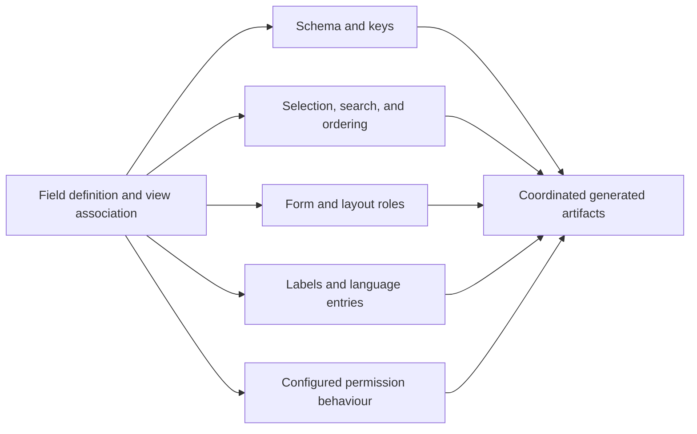

# Semantic classification and routing

The compiler's central operation is to examine a definition in context and distribute its consequences to the places that will need them. This is semantic classification and routing: deciding what the definition means for each concern, retaining the relevant result under an appropriate key, and allowing later consumers to assemble the final artifacts.

The operation is more than sorting values into an order. A field contributes different information to a schema, a form, a list, a query, a language catalogue, and a runtime metadata map. Those contributions share an origin but are not interchangeable copies. [C05](../reference/source-map.md#c05)

## One field, several interpretations

JCB's field-building collaborators handle database properties and keys, list membership, joined fields, history, aliases, titles, field relations, hidden and integer fields, storage conversion, categories, tags, custom field links, scripts, sorting, searching, filtering, layouts, language strings, and the generated component-field map.

Not every field activates every branch. Its type, configuration, view association, target, and selected features determine the contributions. The Greeting example activates a small but visible subset: column definition, title and list behaviour, sorting, search participation, form attributes, language entries, and table metadata. [Field trace](../examples/field-trace.md)

The architectural value is that these effects are derived together from the same identified use. The developer does not need to remember every destination and manually restate the decision in each generated file.

## Contributions have different types and update rules

Represent the interpretation as an ordered sequence

$$
J(d,\Gamma)=\langle c_1,\ldots,c_m\rangle,
\qquad c_i=(s_i,k_i,\omega_i,v_i).
$$

Here $s_i$ selects a store, $k_i$ a key, $\omega_i$ an update operation, and $v_i$ a value. An update may replace a known binding, append a list member, concatenate a fragment, set a requirement flag, or enqueue a later operation.

The operation is part of the contribution's meaning. Replacing a title binding is not equivalent to appending a searchable field. Concatenating method fragments is not equivalent to deduplicating a set of dependencies. The mathematical representation retains those distinctions rather than turning every intermediate store into a set of facts.

The accumulated state after interpreting a use is

$$
M'=\operatorname{apply}(\langle c_1,\ldots,c_m\rangle,M).
$$

When two contributions update the same key, their prescribed operation and sequence determine the result. The source uses explicit orchestration; it does not require arbitrary reordering to be harmless.

## Fan-out and fan-in are both present

A field's consequences fan out into several stores. Later, a schema emitter combines contributions from many fields into one table definition. A list model combines selected columns, joins, filters, search clauses, ordering rules, and custom methods. A form combines standard fields, application fields, fieldsets, conditions, permissions, and layout choices.

This is a many-to-many relationship between definitions and outputs. A registry is the physical representation of part of that relationship, not its complete explanation.

The diagram shows possible concern families. A specific build follows only the branches enabled by its definitions and rules.

## Derived names retain use-site context

A field's logical name can require normalization and collision handling within a view. JCB's naming services track names within their scope and allocate suffixes where repeated uses would otherwise collide. The resulting name is then reused by downstream schema, query, form, and metadata consumers. [C04](../reference/source-map.md#c04)

The scope is crucial. Two unrelated views may each use a field named `title` without needing a globally unique application-wide field name. Conversely, two conflicting occurrences in the same generated scope may need distinct names even when their reusable definitions are individually valid.

A language-neutral implementation should retain the resolved name as a contribution of the occurrence. Recomputing it independently in each emitter risks selecting different suffixes or prefixes.

## Relations can transform values or presentation

The documented field-relations feature distinguishes model-side processing from view-side composition. Combining raw values before or after model treatment is different from combining the generated presentation of those fields. The latter can include links, formatting, and permission-related structure. [D01](../reference/source-map.md#d01), [C05](../reference/source-map.md#c05)

This is another example of contextual classification. The same referenced field is interpreted under the role selected for the relation. Calling every relation “a join” would obscure whether the operation changes the query, the modeled value, or the final display fragment.

## What consistency means here

The compiler aims to keep projections of one design decision aligned. A resolved field name should agree across its form and data paths. A storage treatment should agree between save and load logic. A language key emitted into a form should have the intended catalogue entry. A target-specific class reference should agree with its namespace and imports.

These are concrete cross-artifact relationships, not a claim that every generated application has been formally verified. The [formal classification chapter](../formal/classification.md) states how such relationships can be expressed and checked. The public worked examples show selected relationships in actual output.

Classification makes a compact blueprint effective because repeated implementation knowledge already resides in the compiler's rules. Its output is not information created from nothing: it is the contextual assembly of design choices, generation knowledge, reusable code, and supplied assets.
