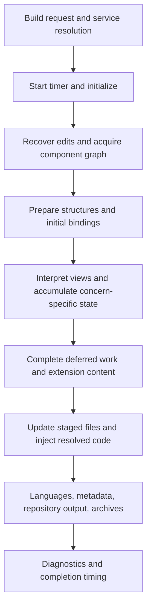

# Compiler execution from entry to package

The compiler's execution begins before its final `run` method. Resolving and constructing the compiler service starts timing, initializes the component, and invokes inherited content preparation. The later `run` method completes file updates, custom-code placement, language material, repository output, and packaging. A trace that begins only at `run` omits much of the compilation. [C01](../reference/source-map.md#c01)

This distinction is the starting point for the architectural model. The compiler is a coordinated sequence of operations with shared state, not a function name attached to the last filesystem pass.

## Entry and service construction

The authoring interface and command-line entry paths select build configuration and obtain compiler services through the factory and dependency-injection container. Shared services give producers and consumers access to the same build configuration, definition stores, specialised builders, and output-binding environments. Resolving a service can itself construct collaborators whose initialization has effects.

The relevant boundary is therefore the complete build request, including service resolution. A language-neutral implementation can expose a more explicit `prepare` operation, but it must not omit the work performed by the source implementation during construction. [C02](../reference/source-map.md#c02)

## Initialization establishes the working design

The initializer has a once-only guard. Its visible sequence establishes language and field-building settings, recovers designated code from installed targets, loads and enriches the selected component, processes version information, resets the build directory, acquires utility Powers, and builds the required structures.

The order of recovery and reset is significant. Existing designated edits are inspected before the working output is cleared for the new build. Component acquisition also precedes several structure decisions, because the selected views, modules, plugins, and libraries determine which structures are required.

Events bracket parts of this sequence and can modify the effective input. They belong to the operational account, not an unmodeled background layer. [Events and effects](events.md)

## Content preparation distributes semantic consequences

The content-preparation phase, named *Infusion* in the implementation, establishes shared component bindings and then works through admin views, custom admin views, component-wide aggregates, deferred admin work, configuration fieldsets, site views, and associated extension content.

Its operations do more than fill final text slots. They call creators and architecture services that interpret definitions, collect schema and query information, prepare names and language entries, generate method fragments, and accumulate requirements for subsequent consumers. The [classification](classification.md), [stores](stores.md), and [deferred-work](deferred-work.md) chapters examine this phase in detail.

The diagram summarizes semantic responsibilities. It does not imply that all acquisition finishes before the first file is created. Skeleton construction occurs while later semantic work remains, and additional dependencies can be acquired during file updating.

## Final file processing

The final orchestration initializes temporary, backup, and repository paths, applies configured site/API cleanup, and triggers the pre-update event. It then invokes the extension file updater.

The updater handles the relevant static, dynamic, module, plugin, and Power files. Per-file content processing applies shared and contextual bindings, conditional custom-code processing, events, and Power injection before writing. Later custom-code placement can use stored location fingerprints. [Binding](binding.md), [Custom code](custom-code.md), [Materialization](../generation/materialization.md)

After file updates, the compiler builds language file data, reports language and asset-table messages, handles update XML destinations, generates README material, and writes configured local repository outputs. Component, module, and plugin archives are then produced through their respective paths.

## Completion is a report over several operations

The main orchestration returns failure on a failed extension-file update or component archive operation. Module and plugin packaging have their own processing and messages. Warnings about language mismatches, external code, or recoverable placement remain meaningful even where the principal build returns success.

The paper therefore models a result as artifacts together with diagnostics and effects:

$$
\operatorname{compile}(I)=(A,\Delta,\tau),
$$

where $A$ is the artifact collection, $\Delta$ the diagnostic result, and $\tau$ the relevant execution trace. A single Boolean is useful to the calling interface but does not express every detail of those outcomes.

On the successful path, the timer stops after the final packaging and notices. The elapsed measurement consequently includes initialization and content preparation, not merely the last placeholder replacement. [Build measurements](../engineering/performance.md)

## What the sequence explains

The sequence makes the compiler's coordination visible. Definitions become available before their dependent interpretation; some interpretations contribute facts that later creators require; contextual bindings are established before their consumers; physical files pass through several stages before becoming packaged products.

That is why the implementation cannot be adequately explained as one loop over templates. Its behaviour depends on the state accumulated across those responsibilities and on the points at which incomplete work becomes ready to finish. The [formal state model](../formal/state.md) expresses the same execution as transitions over identified state components.
