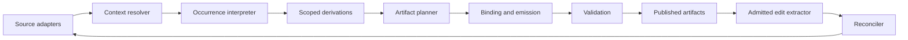

# Language-independent implementation guide

## Begin with the semantic boundary

Write down the task, complete input tuple, output equivalence, and permitted feedback. A code generator, document assembler, and configuration synthesizer can share the same architecture while using different fact types and emitters.

Do not begin by creating a global registry class. Begin by identifying what a fact means, who owns it, when it is authoritative, and which context dimensions can change its interpretation.

## Separate the contracts

A portable design has adapters for source acquisition and persistence; a context resolver; occurrence expansion; scoped derivation; artifact planning; staged binding; validation; and publication. The round-trip profile adds an extractor and reconciler before the source epoch is frozen.



The boxes are responsibilities, not mandatory processes or services. A small implementation can combine them while retaining explicit interfaces and tests.

## An implementation sequence

First implement stable request identities and a frozen source adapter. Add a resolver whose dependency behavior is either stable per request or explicitly tracked against changing knowledge. Test missing requests and cycles before optimizing acquisition.

Next distinguish definitions from occurrences. Pass target and ownership context explicitly. Keep immutable base definitions separate from mutable or derived occurrence values. Define collision behavior before adding multiple writers.

Then implement derivation in a bounded positive fragment. Add negative conditions only across closed strata or under a separately specified resolution policy. Aggregate ordered collections after their membership is complete.

Finally, plan every artifact, validate destination uniqueness, apply binding stages, and check required obligations before publication. Add round-trip editing only after region identity and ownership are defined; otherwise preservation becomes a collection of path heuristics.

## Representation choices

In PHP, typed value objects and associative arrays can implement the contracts. In Python, immutable dataclasses and dictionaries are convenient. In Rust or C++, enums/variants and ownership-aware stores can make absent/conflict states explicit. A relational or graph database can implement persistent provenance or large context stores.

These are design possibilities, not performance recommendations ranking languages. The important property is semantic agreement at the interfaces. A structured AST emitter may be preferable to strings for a language target, while Markdown fragments may be appropriate for documents.

## Pseudocode

```text
candidates := extract_admissible_edits(previous_artifacts)
editorial_state := reconcile(previous_baseline, current_source, candidates)
input := freeze(source, editorial_state, rules, templates, target, environment)
context := complete_requests(input, roots)
occurrences := expand_definitions(context, roots)
knowledge := derive_in_declared_strata(context, occurrences)
plan := plan_artifacts(knowledge)
require unique_identities_and_destinations(plan)
staged := bind_and_emit(plan, knowledge, editorial_state)
require validate(staged, plan)
publish(staged, manifest(input, staged))
```

Each `require` has a defined failure result. A failed build must not be mislabeled successful merely because some files were written.

## Adopting only part of the framework

An implementation can claim the core synthesis profile without editorial recovery, or the round-trip profile without self-generation. State the implemented profile and the tested contracts. Do not advertise complete conformance merely because a demo uses the word VDMT.

The [reference model](reference-model.md) provides executable examples of the bounded contracts. It is a starting point for understanding and testing, not a replacement for domain-specific validation, deployment security, or a production compiler.
