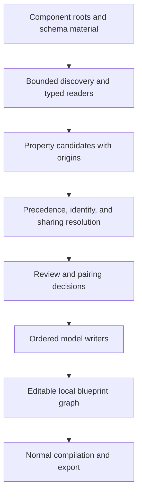

# Extrusion from installed applications

Extrusion brings an existing application's represented structure into JCB's editable model. Its inputs can include component folders, explicit administrator and site roots, and a schema dump. It discovers relevant artifacts, reads their structure without executing the application, resolves the information they supply, presents candidates for pairing, and writes selected definitions into JCB.

The operation closes a useful development path: an application need not begin as a JCB blueprint to supply recoverable fields, schema, views, presentation material, or reusable classes. Once represented locally, the recovered definitions join the ordinary editing, export, dependency, and compilation workflows. [X01](../reference/source-map.md#x01)

## Discovery, interpretation, and writing are separate

The component extruder exposes a harvest operation that gathers and assembles the source without writing definitions. Its candidates operation presents the recovered items against a selected component's existing definitions. The writing operation then applies reuse and pairing decisions before dispatching the appropriate writers.

This separation is architectural, not merely a confirmation dialog around an opaque import. The intermediate registries retain the inventory, source facts, resolved properties, proposed identities, decisions, and report. A caller can inspect what the system found before changing the destination model.

Class-library extrusion has a related but separate path: harvest class candidates, resolve their identities and namespaces, assemble Power definitions and relationships, and write the selected code definitions. [Class recovery](classes.md)

## An installed component is evidence, not an original blueprint

A schema states columns, types, defaults, and keys. Form XML states controls and their configured attributes. Language files explain represented constants. A generated table-definition class can retain detailed model metadata. A manifest identifies the extension and its installation structure. Source files preserve authored code and presentation material.

Those artifacts overlap, but none must contain every decision that originally produced the application. Extrusion combines what each can state rather than assuming that one artifact is a complete inverse of compilation.

For source artifacts $A$, write

$$
H=\operatorname{harvest}(A),\qquad
Q=\operatorname{resolve}(H),\qquad
D'=\operatorname{write}(D,Q,V),
$$

where $H$ retains observed facts and origins, $Q$ contains resolved candidates, $V$ contains review decisions, and $D$ is the existing local model. The middle representation makes uncertainty, precedence, and identity available for examination before persistence.

## Multiple starting points use the same recovery machinery

An installed Joomla component can provide distinct administrator and site roots. An unpacked package can supply the equivalent source tree. A bare schema dump supplies less information but can still describe fields and candidate admin views. A folder and a dump can be combined.

The implementation accepts a component name explicitly; otherwise, manifest information has precedence over a name inferred from table prefixes. Where a name cannot be established, the report identifies the unresolved naming context rather than inventing an unrelated component identity. [X01](../reference/source-map.md#x01)

Discovery supports Joomla layout profiles and bounded scanning. The inspected configuration defaults to a depth of 12 and a maximum of 20,000 files, with include/exclude selections and explicit administrator/site options. Those limits bound the examination; they are not claims about the size of every supported installation.

## Recovered content returns to ordinary compiler abstractions

The writer sequence creates or updates the component details, fields, admin views and their associations, conditions, Dynamic Gets, site views, and custom-admin view relationships in dependency order. Recovered presentation code belongs to the appropriate view or reusable presentation role rather than becoming an arbitrary extra file with no model connection.

The compiler can subsequently regenerate an application from those definitions using its existing rules. Extrusion therefore does not require a second compiler specialized for imported projects. It feeds the same modeled concerns through the existing pipeline.

## The operation reports its actual outcome

The report records artifacts read, views assembled, definitions written, reused identities, shared fields, skipped decisions, unresolved types, and other recovery details. A successfully completed operation can still contain explicitly reported shortfalls or deliberate skips.

For example, an unmapped field type can produce a custom-field candidate requiring configuration; a type that cannot be resolved at all can prevent that field from being written. A condition referring to a field managed implicitly by JCB may not be reconstructed as an ordinary field dependency. Those outcomes are part of the represented operation, not silently treated as recovered facts. [X01](../reference/source-map.md#x01), [X04](../reference/source-map.md#x04)

The integrated extrusion capability described in this edition is identified in the [edition record](../reference/edition.md). Its mechanisms are explained as implemented operations, with source responsibilities recorded separately from the older core compiler pin.
