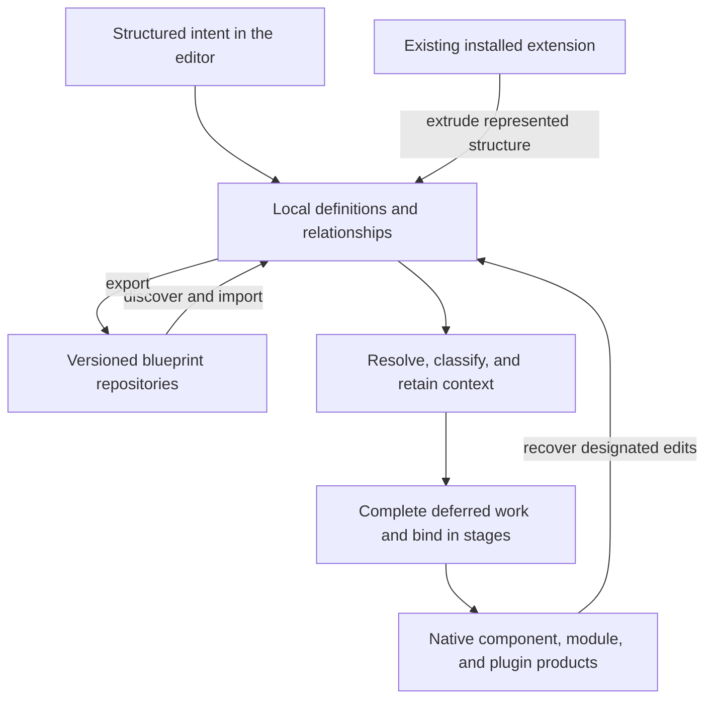

# Joomla Component Builder Architecture

**Contextual compilation from structured intent to complete applications**  
**Llewellyn van der Merwe · Technical white paper · Edition 1.0.0**

A field called *Greeting* appears to be a small definition: a type, a name, a label, and a few settings. In a generated application, that definition participates in a database column, an editor, a list query, sorting, searching, language entries, and a machine-readable table description. Its use in a view adds further decisions: whether it is the title, where it appears, and which interactions it supports. Those consequences must agree without being specified independently in every destination.

Joomla Component Builder coordinates that work through a compiler. It retrieves definitions and their dependencies, interprets each use in context, distributes the results into specialised intermediate stores, retains work that must wait for other information, and binds completed material into native components, modules, and plugins. This publication explains that architecture at the level of its operations, mathematical structure, and observable products.

## Follow one definition through the system

The [Hello World example](examples/hello-world.md) connects a public blueprint repository to three generated extension repositories. The [Greeting field trace](examples/field-trace.md) follows a stable field identifier into its form, database schema, language keys, list behaviour, and generated metadata. The [custom-code trace](examples/custom-code-trace.md) follows deliberate markers from GUI-backed blueprint properties into their target methods and files.

These examples provide a concrete entry into the deeper account. A reusable definition is one object; its uses, accumulated consequences, and output locations are different objects. The architecture makes those distinctions operational.

The repository exchange, installed-extension extrusion, and marked-edit recovery paths perform different transformations. The compiler connects them by consuming the resulting definitions through the same generation machinery. [Lifecycle](foundations/lifecycle.md)

## Read the integrated argument

The [white paper](white-paper.md) presents the complete argument in one continuous article. The [reading guide](reading-guide.md) offers shorter routes through the same material.

The detailed chapters explain the [blueprint representation](blueprints/representation.md), [local-first discovery](blueprints/discovery.md), [compiler execution](compiler/execution.md), [semantic classification](compiler/classification.md), [intermediate stores](compiler/stores.md), [deferred work](compiler/deferred-work.md), and [binding stages](compiler/binding.md). Application-generation chapters follow those mechanisms into schemas, queries, interfaces, permissions, languages, routing, and packaging.

The [formal model](formal/notation.md) expresses identities, state transitions, dependency traversal, contextual interpretation, and staged substitution without depending on PHP syntax. The [implementation guide](engineering/implementation.md) shows how those operations can be represented in another language. The [source map](reference/source-map.md) reconnects the abstraction to the implementation.

## A development lifecycle, not a one-time scaffold

Blueprints can be exported, reviewed in Git, imported into another JCB instance, and compiled again. Existing extensions can supply recoverable structure through [extrusion](extrusion/overview.md). Reusable library definitions can be acquired when needed and placed according to their resolved namespaces. Compiler and target-rule changes can then be applied through [regeneration](engineering/regeneration.md), rather than repeated separately across every application.

JCB's own generated application is part of this account. [Self-generation and maintenance](engineering/regeneration.md) explains the relationship between its blueprint, reusable library inputs, compiler, and generated application layers. [Build measurements](engineering/performance.md) distinguish blueprint size, supplied reusable code, output size, and elapsed compilation time.

**The subject is how these operations fit together.** The implementation gives the account its substance; the abstraction makes the approach available for examination and reuse beyond Joomla.

Every article has an exact Markdown equivalent. Authorship, source revisions, implementation coverage, and publication conventions are recorded in the [edition](reference/edition.md) and [citation](reference/citation.md) pages.
