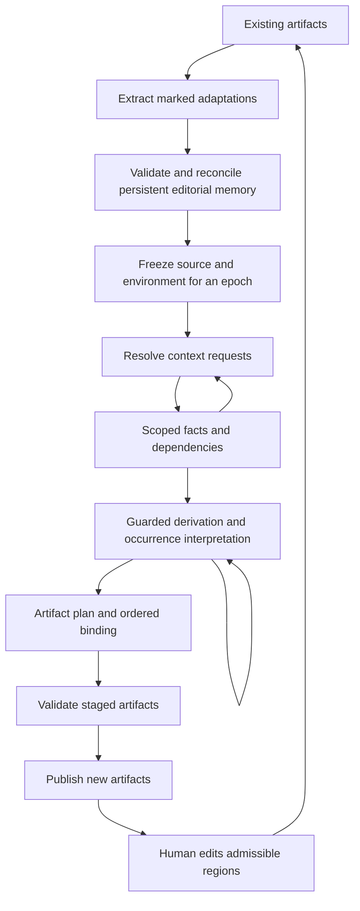

# The two-loop lifecycle

## The inner loop completes knowledge

Within a frozen epoch, requests reveal dependencies and established facts enable derivations. The process continues until the required context and the applicable positive derivations are closed. This loop has a finite-growth or other explicit termination argument.

## The outer loop preserves development

Between epochs, a human can edit designated regions of an existing artifact. Extraction and reconciliation turn admissible changes into durable input for the next build. This loop is intentionally open-ended: continued development changes the problem being solved.

The self-arrows mean bounded saturation under the specified contracts, not unrestricted recursion. Publication failure does not authorize replacing the last successful artifact set.

## Epoch equation

A simplified cross-build relation is

$$
M_{e+1}=\mu(M_e,X(A'_e)),
$$
$$
A_{e+1}=B(D_{e+1},M_{e+1},\Theta_{e+1},C_{e+1},E_{e+1}),
$$

where $A'_e$ is the previously generated artifact after admissible human editing. The extraction function is partial and reconciliation can return a conflict. The equation is not an instruction to overwrite source records on every scan.

## Why the distinction matters

The inner loop can be monotone while the outer loop replaces or removes information. A proof of finite monotone closure therefore cannot be applied to the whole history of a developing application.

Similarly, a no-edit round-trip law concerns preservation of editorial memory. It does not imply that different versions of the generator, source data, or target framework produce identical artifacts.

## A practical execution policy

Recover marked edits before destructively resetting build directories. Validate and persist them before freezing the new source epoch. Resolve the task context, derive occurrence-specific values, and distinguish incomplete skeletons from complete artifacts. Apply binding stages in a declared order, then validate before publication.

The current JCB initializer visibly places custom-code extraction before component building and before build-directory removal. This ordering is an important concrete realization of the feedback path. [J04](../reference/bibliography.md#j04), [J11](../reference/bibliography.md#j11)

## Beyond files

The same lifecycle can apply to a generated report with editable sections, a configuration graph with approved overrides, or a knowledge workspace with attributed human corrections. The persistence medium may be a database, a versioned document store, or a repository. What must remain stable is the distinction between authoritative source, temporary derivation, generated artifact, and admitted feedback.
