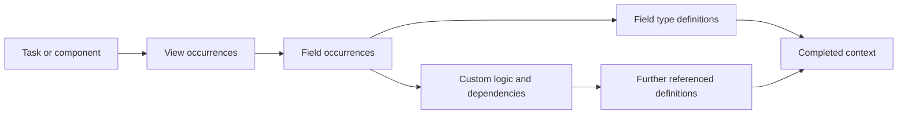

# Nested gathering and the inner loop

## The first answer changes the next question

The originator emphasizes a small loop inside initial context loading: gathering an object reveals more data that must itself be gathered. This is more than loading a large table into memory. It is a dependency-driven construction of the task's usable context.

A typical chain is:

The graph explains the logical relationship, not an assertion that all these objects are loaded by one generic graph engine in JCB.

## A double loop is an implementation shape

An outer loop may enumerate views and an inner loop enumerate their fields. Each field load may join its field type and discover custom-code dependencies. A different implementation could use a queue, recursive calls, batched SQL, or an asynchronous resolver and still realize the same context closure.

Consequently, “double loop” should not be elevated into a universal requirement of exactly two iterations. The theory identifies the operation that the loops perform: resolve a set of requests and add newly discovered requests until the required context is closed.

## Three kinds of recurrence

**Containment traversal** follows component-to-view-to-field relationships. **Reference traversal** follows shared definitions and reusable code dependencies. **Retry or fallback acquisition** attempts another source when a definition is not available locally.

These are not interchangeable. A containment cycle may indicate a modeling error. A reference cycle can be harmless for discovery but problematic for expansion. A retry loop requires a bound and must distinguish absence from acquisition failure.

## Source evidence

At the pinned JCB revision, `Component\Data::energize()` calls `setViews()` among other enrichments. `Model\Adminviews` decodes the configured view relationships, sets context flags, and loads each view's settings through an admin-data service. `Field\Data` joins fields with field types, indexes retrieved fields, and permits a guarded one-time remote fetch before trying the load again. These are concrete nested acquisition and enrichment mechanisms. [J05](../reference/bibliography.md#j05), [J09](../reference/bibliography.md#j09), [J10](../reference/bibliography.md#j10)

This evidence supports nested gathering. It does not establish that the contemporary compiler uses the formal worklist in [context closure](../semantics/context-closure.md), nor that all dependencies are known before file structures begin to exist.

## Correctness obligations

Every discovered request must have stable identity. A completed request must not be confused with a request whose acquisition failed. A context-sensitive resolver must be revisited when its declared prerequisites change. Remote acquisitions must become part of the identified build input.

A useful diagnostic is to record the parent request for each newly discovered request. Then “why was this class loaded?” can be answered by a dependency path rather than by speculation about execution order.

## Reusable insight

The important feedback is local and constructive: the answer to one request enriches the space of subsequent requests. That pattern applies to schema compilation, document assembly, configuration synthesis, and retrieval systems. Its correctness depends on bounded discovery and explicit authority, not on its resemblance to a human train of thought.
