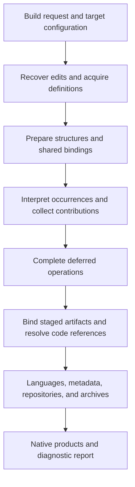

# Joomla Component Builder: Contextual Compilation Architecture

**Structured intent, portable definitions, and coordinated application generation**  
**Llewellyn van der Merwe · Vast Development Method**  
Technical white paper · Edition 1.0.0 · 16 September 2026

## Abstract

Joomla Component Builder transforms a structured application model into complete native components, modules, and plugins. Its compiler coordinates information that becomes available at different times and contributes to different output concerns. Reusable definitions are acquired by identity, interpreted in their occurrence contexts, and distributed into specialized intermediate stores. Deferred operations retain work until its prerequisites are established. Ordered binding and code injection then complete staged artifacts under target-specific conventions.

This paper describes that implemented architecture and expresses its operations in language-neutral terms. The account connects GUI-authored intent, database definitions, repository blueprints, local-first dependency discovery, contextual compilation, installed-component extrusion, designated-code recovery, and regeneration. A public Hello World blueprint and its three generated products provide inspectable traces. A field's properties and association roles are followed into its database schema, form, list behavior, language entries, and generated metadata; marked code is followed from its source property to its generated location.

The formal treatment distinguishes definitions, occurrences, contributions, and artifacts; models ordered effects; establishes finite guarded traversal under stated conditions; specifies exact binding semantics; and defines the equivalences relevant to blueprint transport and reconstruction. These abstractions make the design available for examination and implementation outside Joomla without discarding the behaviors that make its coordination work.

## 1. The problem is coordinated detail

A field called *Greeting* can be described with a type, name, label, database properties, and a few interface settings. Its use in a view adds decisions such as title status, list visibility, search, sorting, and placement. A working application needs the consequences of those decisions in several places: schema, queries, forms, model methods, language catalogues, list headers, metadata, and sometimes permission-sensitive data paths.

The difficulty is not producing one form element. It is keeping the related implementations consistent while definitions are reused, contexts change, dependencies are discovered, and different output stages execute. A developer should not have to repeat one decision independently in every destination or manually reconstruct the relationship between its effects after a platform change.

I developed JCB to make that recurring work explicit and reusable. The original implementation grew from solving the application-building problem directly. Its responsibilities were subsequently separated into specialized services while preserving the coordinated flow of definitions, intermediate results, and generated products. The public source lineage begins on 30 January 2016; this edition gives the implemented architecture a systematic account. [Development and provenance](foundations/provenance.md)

The core subject is **contextual compilation**: reuse identified design knowledge, interpret each use under its actual context, retain its different consequences, and complete each output operation at the point its required information is available. Export, import, extrusion, and recovery connect that compiler to a continuing development lifecycle. [C01–C07](reference/source-map.md#c01)

## 2. Structured intent is an executable design description

JCB's GUI represents application intent through typed choices and relationships. Field types describe reusable kinds of controls; fields configure them; view associations establish their roles; views define data retrieval and presentation; components select those views and associated extensions. Authored code occupies designated roles where application-specific behavior is needed.

The GUI is an authoring surface, not the semantic definition of compilation. The same represented intent can enter through a repository blueprint or recovered model. The database stores a local editable form of it. Normalization and interpretation connect that form to the compiler's rules. [Structured intent](foundations/structured-intent.md)

Let an authoring input $u$ be normalized into design $D=N(u)$. For concern $k$ and target $T$, the compiler computes a projection

$$
P_{k,T}(D,\Gamma),
$$

where $\Gamma$ supplies the relevant occurrence context. The result can be structured data, code, a requirement, or no contribution when the selected feature is inactive. A searchable flag, for example, requests known search behavior; the compiler supplies its implementation conventions rather than inferring an unstated business rule from the field's label.

A compact blueprint is effective because reusable knowledge also resides in the compiler, templates, target rules, Powers, and supplied libraries. Generated size therefore measures the materialized combination of design and reusable implementation knowledge, not information produced from the blueprint alone.

## 3. Four objects must remain distinct

A **definition** is reusable knowledge. An **occurrence** is its use under an association and context. A **contribution** is a result retained for a particular generation concern. An **artifact** is a staged or completed output.

A portable identity is a typed request

$$
u=(t,k,v),
$$

where $t$ is the entity type, $k$ its identifying field, and $v$ its normalized value. Many entities use GUIDs; custom code can use a function-name alias; owned children can use a parent relationship key. A local database primary key is a realization of that identity, not necessarily its portable value.

An occurrence can be represented as

$$
o=(u,p,a),
$$

with use position $p$ and association settings $a$. Its context includes target, extension, view or use-site, generation role, language destination, active bindings, and additional settings. JCB carries these dimensions through records, service arguments, configuration, and scoped store keys. The mathematical tuple describes the role without requiring a matching allocated object. [Identity](foundations/identity.md), [context](foundations/context.md)

Interpretation produces an ordered contribution sequence:

$$
J(d,\Gamma)=\langle c_1,\ldots,c_m\rangle,
\qquad c_i=(s_i,k_i,\omega_i,v_i).
$$

Each contribution identifies a store, key, update operation, and value. A title binding can be set; a searchable field can be appended; a language key can be filled; a code fragment can be concatenated; an operation can be deferred. These are different updates, even where the physical stores use similar registry machinery.

The output relation is many-to-many. One field can affect several files; one model file can combine many fields, joins, policies, and custom fragments. Counting definitions, occurrences, contributions, and artifacts as if they were the same objects would hide the architecture's actual expansion.

## 4. Portable blueprints form a discoverable graph

A blueprint repository contains authoritative payloads and supporting distribution material. Payloads carry design properties, code, associations, and dependency descriptors. Indexes locate those payloads. Generated Markdown describes them. Assets supply referenced content. The entire repository is not counted as if every README paragraph were another compiler input decision. [Blueprint representation](blueprints/representation.md)

Export selects a root and traverses its supported relationships. Type-specific configuration determines identifying fields, portable properties, child records, encoding, indexes, and asset targets. Installation-specific fields can be omitted. The writer then creates or updates payloads, readable item descriptions, and merged indexes in eligible repositories. Writes have per-item and per-repository outcomes rather than an assumed global transaction. [Export](blueprints/export.md)

Import follows the opposite representation boundary. Ordinary initialization first preserves an acceptable local definition. Where missing, it selects an applicable configured repository entry, retrieves and maps its payload, persists it locally, and follows discovered dependencies. Reset is an explicit refresh operation. Incoming owned child records and outgoing reusable references can follow different recursive reset policies. [Import and reset](blueprints/import.md)

The inspected entity catalogue contains 45 canonical types: components and their associations, modules, plugins and class-related definitions, admin and site views, fields, field types, validation rules, layouts, templates, Dynamic Gets, custom code, libraries, placeholders, Powers, repositories, and snippets. File/folder content has separate handlers. This common acquisition structure is broader than Power retrieval alone. [Entity catalogue](blueprints/discovery.md), [B01](reference/source-map.md#b01)

“Global” discovery is bounded by the configured sources. Their order, branches, channels, and indexes determine selection. The inspected lookup selects an index match before fetching its payload; a failed selected payload does not automatically imply that every later repository will be tried. Once accepted, the definition becomes local editable knowledge, not transient text available only to one template.

## 5. Dependency completion is controlled discovery

Resolving one request can reveal others. A component points to view associations; an association points to a view; the view points to fields; fields point to types and rules. Recognized code references, nested subforms, templates, layouts, and assets add further edges.

Let $R_0$ be root requests and $\operatorname{deps}(u)$ the relation extracted by the supported resolver. The reachable set satisfies

$$
R_{i+1}=R_i\cup\bigcup_{u\in R_i}\operatorname{deps}(u).
$$

For a finite reachable universe, this reaches the least dependency-closed set containing the roots. The production traversal uses nested handlers and queue drains. It retains attempted-request state so a shared or cyclic dependency does not cause endless reacquisition. [Dependency traversal](blueprints/dependencies.md)

A small operational form is:

```text
pending := normalized roots
attempted := empty
while pending is not empty:
    request := remove the next request
    if request has not been attempted:
        mark it before recursive work can re-enter it
        acquire it under the selected local/repository policy
        record the actual outcome
        enqueue supported dependencies exposed by the result
transport accumulated file and folder requirements
```

If each handler completes and each first visit enqueues finitely many members of a finite universe $U$, the lexicographic measure

$$
(|U\setminus\mathrm{attempted}|,|\mathrm{pending}|)
$$

decreases: a first visit decreases its first component; a duplicate removal decreases the second. Cycles are compatible with termination. Successful completeness remains a separate condition: an attempted missing definition is not a resolved one, and local-preservation paths rely on their required dependencies already being available or discovered elsewhere. [Formal resolution](formal/resolution.md)

This closure describes acquisition, not every operation in the compiler. Later semantic processing includes replacement, removal, code effects, and context changes that should not be recast as one monotone fact-accumulation algorithm.

## 6. Compilation begins before the final run method

The complete execution includes service resolution and constructor work. The compiler starts timing, initializes its working state, and invokes content preparation before its final orchestration method runs. The initializer recovers designated edits from installed targets before rebuilding the component and resetting the working output. It then establishes component data, version settings, utility dependencies, and structures. [Execution](compiler/execution.md), [C01](reference/source-map.md#c01)

Acquisition enriches raw records into compiler-ready data. Field loading connects ID and GUID forms, obtains type properties, processes XML and validation, and handles selected storage and history information. Returning cached field data can also invoke per-view custom-code processing. The base definition and its use-specific effects therefore have different reuse boundaries. [Acquisition](compiler/acquisition.md)

Physical structure can be created while later semantic work remains. Additional dependencies can appear during code expansion and final injection. The architecture's requirement is that an operation has the information it needs when it consumes it—not that one universal loading pass must finish before any file can exist.



The arrows summarize the main responsibilities. Event handlers, nested acquisition, and extension-specific generation operate at their documented points within that order.

## 7. The central mechanism is semantic classification

A field's interpretation contributes to schema, keys, list membership, joins, title and alias roles, storage transformations, scripts, search, sorting, filtering, layout, language, and generated field metadata. Some branches are inactive for a particular field. Others depend on its view association rather than its reusable definition alone. [Classification](compiler/classification.md), [C05](reference/source-map.md#c05)

The Hello World Greeting field makes the process concrete. Its reusable definition selects a text field, the name `greeting`, label `Greeting`, database type `VARCHAR(255)`, nullable storage, and explicit-index value zero. Its form properties include maximum input length 50 and default text `Some text`. Its admin-view association marks it as the title, searchable, sortable, linked, and first in the selected list/edit positions.

The generated component contains the column, form field, qualified language key, list sorting, and a Table metadata entry carrying the same GUID. It also contains an ordinary index on `greeting` even though the explicit-index property is zero. The compiler derives that index from the field's title role under the applicable non-text branch. [Greeting trace](examples/field-trace.md)

That result is not unexplained template inflation. The definition, occurrence, and rule together determine it. The schema emitter and metadata emitter consume the same interpreted key requirement, so the SQL and model metadata agree.

Fan-out and fan-in are both essential. One occurrence distributes several consequences. Later, a query combines selections, aliases, joins, filters, ordering, and custom code; a form combines field definitions, placement, conditions, policy, and labels. Intermediate stores connect these producers and consumers without forcing each emitter to rediscover the model independently.

## 8. Retained state has types, scope, and lifetime

JCB uses several kinds of retained information: acquired definitions; concern-specific builders; prepared code in dispensers; shared and contextual binding maps; deferred operations; and guards against repeated work. Their physical similarity does not make their contracts identical. [Intermediate stores](compiler/stores.md)

A store is modeled as a partial map $M_s:K_s\rightharpoonup V_s$. Its key can be a definition identity, view name, extension key, field name, or combined address. Its update can set, fill, append, concatenate, or remove. The current filename binding intentionally changes between files. A per-view script guard has a different lifetime from a portable field GUID.

Safe reuse depends on the inputs actually read by an interpretation. If deterministic $J$ depends on definition version $d$, context projection $\pi_J(\Gamma)$, and dependency observation $z$, a sufficient key is

$$
\kappa_J=(\operatorname{id}(d),\operatorname{version}(d),\pi_J(\Gamma),z).
$$

Equal keys then identify equal relevant inputs and equal results. Omitting a language prefix or target dimension is valid only where the interpretation does not depend on it. Repeating a cached effect is another question: concatenating the same script twice still duplicates it, so either idempotence or a correctly scoped contribution guard is required. [Contribution algebra](formal/classification.md)

These distinctions explain the useful “remember now, use later” behavior without a biological-memory claim. The compiler retains an identified representation and recalls or completes it at the consumer that has the required context.

## 9. Deferred work preserves a discovered obligation

Linked-view work can be recognized before the information needed to finish it is ready. The compiler records the operation and its arguments, completes the earlier admin and component work, and then replays the retained operations. Configuration fieldsets similarly have an explicit second pass after earlier contributions are available. [Deferred work](compiler/deferred-work.md), [C07](reference/source-map.md#c07)

For deferred work $w$, the semantic readiness condition is

$$
\operatorname{req}(w)\subseteq\operatorname{avail}(\Sigma).
$$

The production sequence establishes this through designated phases. It need not encode a machine-readable prerequisite set on every entry or run a generic scheduler. What matters is the producer–consumer ordering and retention of the required information.

Deferred execution, lazy acquisition, and late binding remain distinct. The first retains an operation, the second obtains a definition when needed, and the third supplies values in an appropriate output context. The compiler combines all three, but a single word such as *recursion* would not explain their different responsibilities.

A fixed ordered sequence can be repeatable even where reordering its operations changes the result. Confluence is stronger than determinism. The formal model therefore preserves the source's order rather than demanding that every pair of updates commute. [Staging](formal/staging.md)

## 10. Binding completes text in its destination context

Shared bindings carry component-wide values and fragments. Contextual bindings carry view- or extension-specific material. Prepared custom code can remain parameterized until retrieval from the dispenser applies the current placeholders. Per-file processing supplies another ordered sequence of shared binding, contextual binding, selected code expansion, events, and Power injection. [Binding](compiler/binding.md)

Within a pass, JCB uses ordered replacement. For $P=\langle(k_1,v_1),\ldots,(k_n,v_n)\rangle$,

$$
s_0=s,\qquad s_i=\operatorname{replaceAll}(s_{i-1},k_i,v_i).
$$

Later entries can process text introduced by earlier ones. The filtered action first removes map entries absent from the original input and then performs those ordered replacements. For `A → B`, `B → x`, ordinary replacement of `A` produces `x`, while filtered replacement produces `B`. For original input `A B`, both entries survive filtering and the result is `x x`.

The exact distinction matters to another implementation. Simultaneous substitution or indefinite recursive expansion would be different semantics. The [executable companion](engineering/reference-model.md) tests the introduced-token cases directly.

Multiple stages let a prepared fragment acquire its destination's name, namespace, language key, or role. They also establish an ordering obligation: a token introduced by one stage needs an applicable consumer after that stage if it is intended to be resolved during the build. The operation that owns that completion must be identifiable.

## 11. Managed code joins identity to placement

A Power reference identifies a reusable code definition without requiring the author to fix every file-local alias and output path at the reference site. The loader obtains the definition locally or through configured repository acquisition, prepares its relationships, and guards recursive loading. Injection resolves the qualified name, existing imports, short-name collisions, and required import statements in the destination file. [Powers](compiler/powers.md)

The three identities are different: portable Power identity, target-qualified class name, and file-local symbol. Namespace and placement settings also determine whether code belongs in a reusable library location or an extension source role. A complete-class override is a deliberate ownership choice distinct from inserting a method fragment into a generated class.

Joomla Powers add target-sensitive platform mappings. The same logical platform reference can select a namespace and type appropriate to the compile target. Architecture services separately select target-specific controller, model, view, module, plugin, and other emitter implementations. The host running JCB and the platform targeted by the output are not collapsed into one version variable. [Target selection](compiler/targets.md)

Custom code also includes GUI-linked regions, reusable aliases, and explicitly accepted external resources. Preparation can expand those references and discover more Powers or language entries. The code is part of the compiler's information flow, not simply pasted into an arbitrary file after generation has finished. [Custom code](compiler/custom-code.md)

## 12. Generation coordinates complete application concerns

Schema generation retains normalized types, defaults, nullability, keys, storage treatment, and history-derived update information. Query generation retains source/result aliases, joins, predicates, result roles, and runtime filter structure. Form and layout generation combines field properties, occurrence order, tabs, conditions, validation, and nested presentation dependencies. Each uses decisions established elsewhere in the build. [Schemas](generation/schema.md), [queries](generation/queries.md), [forms](generation/forms-layouts.md)

Permissions show why those interactions matter. Field-level options can alter form controls, remove fields, or select hidden treatment under their specific branches. Separately configured strict result handling can redact selected retrieved values. Save generation must distinguish a missing submitted value that should be cleared from a value absent because the current user was not allowed to edit it. Policy therefore affects declarations, presentation, result handling, and persistence together. [Permissions](generation/permissions.md)

Language processing connects emitted keys to source strings and target catalogues. Translation maintenance reuses available records and applies selected inclusion thresholds. Router generation connects views to keys, aliases, and data sources. API and AJAX paths reuse established view identity, policy, input definitions, and authored method roles while retaining their own runtime integration contracts. [Languages](generation/languages.md), [entry surfaces](generation/routing.md)

Components, modules, and plugins have distinct data, structure, context, content, and packaging paths. The Hello World module combines structured redirect configuration with authored redirect behavior; the compiler supplies its native module structure. The plugin's stored name contains a component placeholder; compilation resolves it under the component occurrence into its final plugin identity. [Extension trace](examples/extension-trace.md)

Materialization completes staged files, resolves late code dependencies, supplies autoloading, writes language and installation metadata, and constructs archives. The output is a native application product. Normal application requests do not ask JCB's authoring GUI to interpret the blueprint again. [Materialization](generation/materialization.md)

## 13. Extrusion returns existing structure to the model

The integrated extrusion machinery accepts component roots and schema material, discovers relevant artifacts, and reads their represented structure without executing the application. Schemas, form XML, manifests, language files, table metadata, classes, and presentation files supply overlapping but different evidence. [Extrusion](extrusion/overview.md)

Property resolution is explicit. Its default precedence is table metadata, SQL notes, XML, then derived schema information, with configurable ranks and a stable tie-break. Selection occurs per property and retains the winning value's origin. Zero and false are usable values; null and empty string are excluded by the selected rule. A database default and form default remain different properties. [Artifact analysis](extrusion/analysis.md)

Harvest, candidate presentation, and writing are separate operations. Pairing decisions select create, update, or ignore. Sharing can consolidate compatible fields before associations are written. Writers follow dependency order so later records can refer to identities established earlier. Reports retain deliberate skips and unresolved details.

Class extrusion locates supported named declarations, extracts their bodies, resolves namespace/path relationships, reconstructs supported imports and Power connections, and reverses applicable component or language specialization into reusable representations. The recovered definition then uses the ordinary compiler's acquisition, namespace, binding, and placement services. [Class recovery](extrusion/classes.md), [pairing](extrusion/pairing.md)

Extrusion is not the unique inverse of every possible program. The same ordinary index can have arisen from an explicit index choice or from a title role; SQL alone cannot tell which. Additional metadata and review decisions select a usable model. The recovered model becomes explicit design knowledge for subsequent compilation and export. The [edition record](reference/edition.md) identifies this implemented integrated capability separately from the older core source pin.

## 14. Transport, recovery, and regeneration preserve different things

Let $\beta(D)$ be the normalized blueprint-relevant projection of local design. Define

$$
D_1\equiv_B D_2\quad\Longleftrightarrow\quad\beta(D_1)=\beta(D_2).
$$

A loss-preserving export/import pair, complete required dependencies and assets, consistent identity mapping, and an accepting existing-item policy preserve this relation. Local numeric IDs and intentionally omitted installation state can differ. Regenerated artifact equality additionally depends on target rules, reusable inputs, hooks, and environment observations. [Transport model](formal/transport.md)

Designated-code recovery has another domain. GUI addresses and contextual fingerprints locate eligible authored regions. When a regenerated file's context still identifies the intended placement, the compiler restores the code there. Where an existing file's location cannot be established, it retains commented recovery material and reports the file and recorded location for repositioning. A missing target file has a separate diagnostic.

For uniquely identified non-overlapping regions whose admitted bodies are preserved, extraction after emission returns the same region map. Where generation specializes text and recovery reverses it, the law concerns the canonical representation those transformations preserve. This is a local property of the selected recovery mechanism, not raw equality of entire arbitrarily edited applications.

Regeneration connects these flows. A blueprint transported to another installation can be edited and compiled. A recovered model can join the same process. An authored region can re-enter the next build. The compiler remains the common operation that turns their resulting design knowledge into coordinated products.

## 15. Self-generation and the maintenance multiplier

JCB builds its own application from its blueprint and reusable inputs. Its generated application layers outside the library collection provide the authoring and Joomla integration through which definitions are managed and compilation invoked. The libraries include substantial supplied implementation, including compiler services. [Self-generation](engineering/regeneration.md)

The self-build is

$$
A_J=\operatorname{compile}(B_J,L_J,\Theta_T,C,H),
$$

where $B_J$ is the application blueprint and $L_J$ the reusable library/Power input. Their different origins remain visible; the compiler coordinates their inclusion rather than authoring every library body during the build.

The same separation supplies a maintenance multiplier. A change to a shared target rule can reach each model that consumes that rule on regeneration. A platform mapping can update references across several applications. A field decision can update several artifacts within one application. The propagation is determined by actual dependencies and ownership: authored complete-class replacements and arbitrary embedded code retain their own maintenance responsibilities.

This effect can be inspected directly: identify the changed rule or definition, identify its consumers, regenerate, and compare the affected products. It does not need an invented labor estimate or a market-superiority assertion.

## 16. Measurements and the cost of coordination

Repeated maintained self-builds compile an approximately 30,000-line JCB blueprint into an application exceeding one million lines in approximately 60–64 seconds on the demonstrated setup. The compiler timer includes initialization and content preparation through the successful final packaging path. Reusable rules, templates, Powers, libraries, and assets are additional inputs. [Performance record](engineering/performance.md)

The smaller public Hello World snapshot has 33 payload JSON files, 65,600 serialized bytes, and 1,298 physical payload lines. Its three generated repositories contain 32,988 physical text lines across 286 text files. Indexes, descriptions, binary assets, and repository metadata are counted separately. Escaped newlines inside JSON strings mean physical payload lines are not a measure of decoded program statements or manual effort. [Accounting](examples/accounting.md)

A useful cost model separates acquisition, normalization, contextual interpretation, deferred completion, binding, writing, packaging, and effects. Reuse can replace repeated acquisition cost $na$ with one acquisition plus lookups while retaining the distinct contextual work. It does not remove the cost of writing $B$ required output bytes, which is at least $\Omega(B)$ in a byte-charging model.

Retained state trades acquisition or recomputation against memory and lifecycle obligations. Ordered substitution can repeatedly scan intermediate strings; later expansion can change their size. Repository and local-cache conditions define different workloads. The paper's measurement method records those boundaries instead of using one output ratio as a universal performance conclusion.

## 17. Operational semantics and reusable implementation boundaries

The complete state can be represented as

$$
\Sigma=(q,D,K,O,M,W,P,A,X,\Delta),
$$

covering control position, local design, request state, occurrences, stores, deferred work, bindings, artifacts, external observations, and diagnostics. A transition changes its specified parts. A complete trace includes event handlers and external reads, not only built-in generation functions. [Operational state](formal/state.md)

For fixed initial state, fixed relevant observations, deterministic operations, and a prescribed control policy, corresponding states remain equal by induction through the execution. This establishes repeatability of the explicit model without requiring all mutations to commute. The model also permits explicit failure, partial artifacts, and recovery diagnostics.

An implementation in another language needs the same responsibility boundaries: typed model normalization; portable identity and resolution policy; contextual interpretation; typed contribution operations; scoped stores; deferred prerequisites; target dispatch; explicit binding semantics; staged artifacts; and separate transport/reconstruction contracts. It can use syntax trees instead of fragments, records instead of PHP registries, and another module system instead of PHP namespaces. [Implementation guide](engineering/implementation.md)

A small complete vertical slice is the practical starting point. One field should produce consistent schema, form, query, and metadata; its portable identity should survive transport; changing its context should affect only the intended projections; and a missing dependency should produce a specific result. The executable companion makes selected mechanisms directly testable before a complete application generator is built.

## 18. Intellectual context and conclusion

Model-driven engineering explains the separation of intent and platform implementation. Attribute grammars and JastAdd provide close context for inherited, synthesized, referenced, and demand-evaluated information. MPS mapping labels exemplify retaining input-to-generated relationships for later consumers. Build-system research separates dependencies, scheduling, and rebuilding; memoization addresses repeated computation; modularity addresses change boundaries; bidirectional transformations and protected regions address selected update paths. [Related mechanisms and bibliography](reference/bibliography.md)

These are retrospective connections to established work. They clarify the independently developed JCB architecture without erasing its provenance or treating every similar mechanism as the same complete system.

The resulting account is a compiler-centered composition. Portable identities make definitions discoverable and reusable. Context gives each occurrence its proper interpretation. Specialized stores preserve distinct consequences. Deferred work separates discovery from readiness. Ordered binding and target-aware placement complete native products. Export, import, extrusion, and designated recovery return useful information to the same editable model.

The public traces expose that composition at a small inspectable scale; the generated applications and maintained self-build expose its larger operational use. The mathematics names the relationships that make it coherent. Together they provide a basis for understanding the current implementation, reproducing its architectural choices elsewhere, and studying where a subsequent implementation can improve them.

The [reading guide](reading-guide.md), [source map](reference/source-map.md), [formal vocabulary](formal/notation.md), and [verification guide](engineering/verification.md) provide the detailed continuation. Every article is available as its own exact Markdown source.
